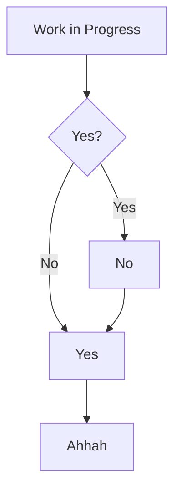

## Contents   
work in progress...

```mermaid
%%{init: {'theme': ''}}%%
flowchart TB
    A[Work in Progress] --> B{Yes?}
    B -->|Yes| C[No]
    B -->|No| D[Yes]
    C --> D[Yes]
    D --> G[Ahhah]
```
